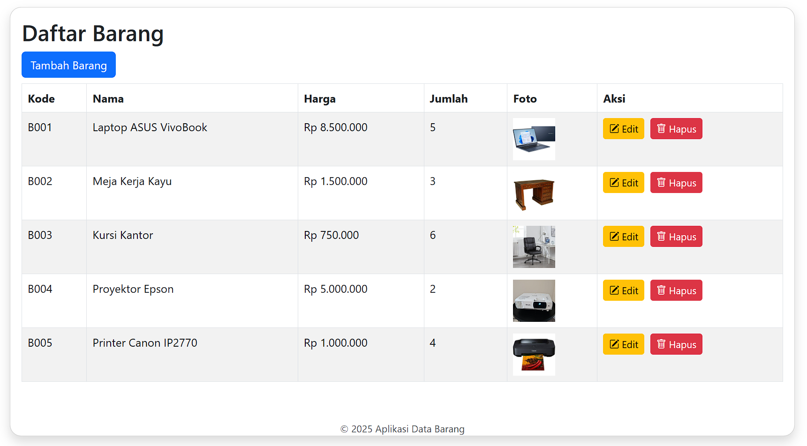

# Aplikasi CRUD Barang

Aplikasi web sederhana menggunakan PHP Native dan Bootstrap untuk mengelola data barang.

## Fitur
- Tambah, ubah, hapus data barang
- Upload foto barang
- Desain responsif dengan Bootstrap

## Cara Menjalankan
1. Copy folder ke `htdocs` di XAMPP
2. Jalankan Apache & MySQL dari XAMPP
3. Buat database `db_barang`, lalu import file SQL
4. Buka `http://localhost/crud_barang/` di browser# crud_barang

## Screenshot Tampilan

